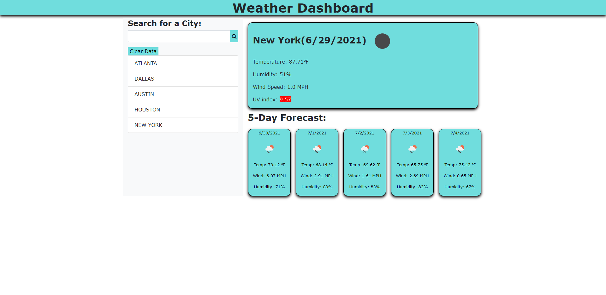

**What's the result of my work for this webpage?**  
I made a weather board using JavaScript, AJAX, CSS, and HTML to display the current weather for a city and the 5-day forecast.
I conditionally changed the UV Index to match the weather channel's UV Index graph.

**What did I learn from this assignment?**  
I learned how to use a variety of functions to populate the weather forecast. I also learned how to call upon an API to
get the weather forecast data to use in my assignment. I did a really good job of describing my code in this one.

**URLs for the Coding Challenge Quiz Website**  
<a href ="https://burkemm.github.io/Matt-Burkes-Weather-Board/">Matt Burke's Weather Dashboard</a>  
<a href ="https://github.com/burkemm/Matt-Burkes-Weather-Board">Matt Burke's Weather Dashboard Github Repository</a>

**What's the current webpage look like?**  

